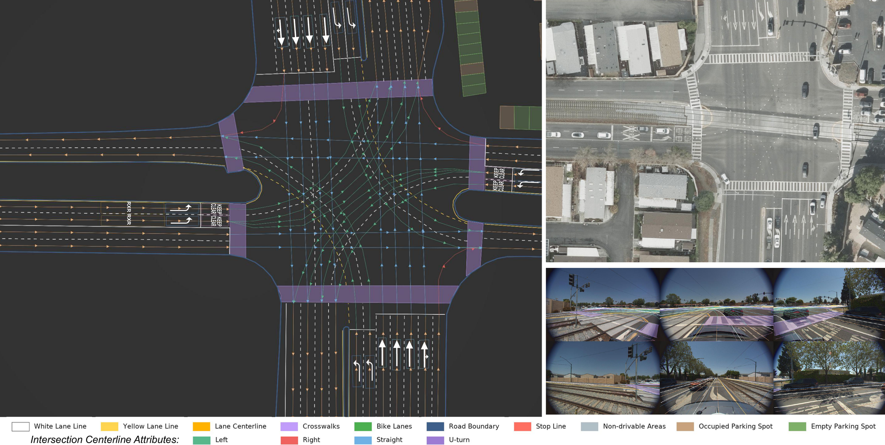

# HRDX: A Large-Scale Vector HD-Map Dataset

[](https://arxiv.org/abs/2606.17080)
[](https://usa.honda-ri.com/hrdx)
[](LICENSE_GPL)

**Sahith Reddy Chada, Isht Dwivedi, Nirav Savaliya**


Honda RDX (HRDX) is a large-scale benchmark for vectorized HD mapping with:

- 40+ hours of driving data
- about 1,400 km of minimally overlapping routes
- 6 synchronized surround cameras
- a 128-beam LiDAR
- centimeter-level GNSS/INS localization
- aligned aerial orthoimagery
- 10 vector map classes with rich semantic and topological attributes

**Dataset download & details:** [usa.honda-ri.com/hrdx](https://usa.honda-ri.com/hrdx) &nbsp;·&nbsp; **Paper:** [arxiv.org/abs/2606.17080](https://arxiv.org/abs/2606.17080)

In addition to the dataset support, this repository contains MapTracker-based training pipelines for:

- camera-only online HD map construction
- aerial-image fusion
- aerial-only ablations
- aerial-to-camera knowledge distillation
- HRDX evaluation with geometry and attribute-aware metrics

This codebase is derived from the original MapTracker project and has been extended for HRDX, aerial supervision, newer MMEngine-based training, and updated experiment workflows.



## Overview

Reliable autonomous driving requires vectorized HD maps with accurate geometry, semantics, and long-range consistency. The HRDX project has two main contributions:

1. A large-scale vector HD-map dataset with dense semantic attributes, precise localization, and aligned aerial imagery.
2. A training protocol showing that aerial imagery is useful both as an auxiliary modality and as privileged information for distilling a stronger camera-only model.

Compared with the original upstream MapTracker release, this repository is centered on the HRDX benchmark and includes additional dataset support, aerial fusion modules, aerial-only variants, and knowledge distillation pipelines.

## Key Contributions

- HRDX is substantially larger than earlier public vector HD-map datasets and covers dense urban, suburban, and highway driving in the San Francisco Bay Area.
- The dataset includes 10 map classes such as lane lines, lane centerlines, stop lines, road boundaries, crosswalks, bike lanes, parking spots, non-drivable areas, intersection centerlines, and text-on-road markings.
- The annotations include rich attributes such as lane-line color and style, turn semantics, and road-surface marking categories.
- The benchmark introduces a Composite Score (CS) that combines geometric localization quality with attribute correctness.
- The codebase extends MapTracker with aerial fusion and aerial-to-camera knowledge distillation, enabling improved camera-only inference without adding inference-time aerial input.

## Repository Layout

- `plugin/configs/maptracker/rdx_dataset/`
  Base camera-only HRDX MapTracker configs.
- `plugin/configs/maptracker_aerial_fuse/rdx_dataset/`
  Camera + aerial multimodal training configs.
- `plugin/configs/maptracker_aerial_only/rdx_dataset/`
  Aerial-only experiments and ablations.
- `plugin/configs/maptracker_knowledge_distillation/rdx_dataset/`
  Aerial-to-camera knowledge distillation experiments.
- `plugin/configs/maptracker_with_lidar/rdx_dataset/`
  Camera + LiDAR multimodal training config
- `plugin/datasets/`
  Dataset classes, pipelines, schema, and evaluation code.
- `plugin/models/`
  MapTracker models, fusion modules, heads, losses, and distillation components.
- `tools/`
  Training, testing, tracking, analysis, and visualization scripts.
- `docs/`
  Installation, data preparation, and usage guides.

## Installation

See [`docs/installation.md`](docs/installation.md) for the full step-by-step
setup, prerequisites (driver / GPU / disk), a verify-the-install check, and
the `environment.yml` fallback.

## Data Preparation

Download the HRDX dataset from the official website: [usa.honda-ri.com/hrdx](https://usa.honda-ri.com/hrdx).

HRDX ships as a refined release — per-sample pickles plus aligned image / LiDAR / aerial roots. Place the bundle under `./datasets/RDX/` so the shipped configs (which use `./datasets/RDX/...` relative paths) work unmodified.

Expected layout under `./datasets/RDX/`:

```
datasets/RDX/
├── HRDX_annotations/                 # per-scene vector map JSONs
├── 1by2.5x_jpegs/                    # 6 surround-view JPEGs (cam_1..cam_6 per scene)
├── aerial_ego_aligned/               # ego-aligned aerial crops by provider
├── pointclouds/                      # 128-beam LiDAR pcds per scene
├── train_1_every_5m.pkl              (+ _gt_tracks.pkl)
└── val_1_every_5m.pkl                (+ _gt_tracks.pkl)
```

The HRDX dataset includes:

- synchronized 6-camera image streams at 10 Hz
- 128-beam LiDAR at 10 Hz
- RTK GNSS/INS poses
- aligned aerial imagery
- vectorized map annotations with geometry, semantics, and attributes

For legacy nuScenes / Argoverse2 setup and the full HRDX layout details,
see [docs/data_preparation.md](docs/data_preparation.md).

## Main Experiment Families

The main HRDX config families in this repository are:

- `plugin/configs/maptracker/rdx_dataset/`
  Standard camera-only MapTracker training on HRDX.
- `plugin/configs/maptracker_aerial_fuse/rdx_dataset/`
  Camera + aerial-image multimodal fusion.
- `plugin/configs/maptracker_aerial_only/rdx_dataset/`
  Aerial-only experiments.
- `plugin/configs/maptracker_knowledge_distillation/rdx_dataset/`
  Aerial-to-camera knowledge distillation, where a camera+aerial teacher supervises a camera-only student.

The HRDX training workflow follows the same three-stage schedule used by MapTracker:

1. BEV pretraining
2. vector-head warmup
3. joint finetuning

Additional HRDX experiments extend this with aerial fusion, aerial-only training, and KD-specific stage-3 variants.

## Training

Distributed training follows the standard entrypoint:

```bash
bash tools/dist_train.sh <CONFIG> <NUM_GPUS>
```

Examples:

```bash
# Camera-only HRDX baseline
bash tools/dist_train.sh \
  plugin/configs/maptracker/rdx_dataset/maptracker_rdx_stage1_bev_pretrain.py 8

# Aerial fusion variant
bash tools/dist_train.sh \
  plugin/configs/maptracker_aerial_fuse/rdx_dataset/maptracker_rdx_stage3_joint_finetune_aerial_fuse.py 8

# Knowledge distillation variant
bash tools/dist_train.sh \
  plugin/configs/maptracker_knowledge_distillation/rdx_dataset/maptracker_rdx_stage3_joint_finetune_kd_head_only.py 8
```

When moving between stages, set `load_from` in the config to the appropriate checkpoint from the preceding stage.

## Evaluation

For distributed test-time evaluation:

```bash
bash tools/dist_test.sh <CONFIG> <CKPT> <NUM_GPUS> --eval --eval-options save_semantic=True
```

The `save_semantic=True` option also saves BEV semantic segmentation outputs.

For tracking-based consistency evaluation:

```bash
python tools/tracking/prepare_pred_tracks.py <CONFIG> --result_path <SUBMISSION.pkl>
python tools/tracking/calculate_cmap.py <CONFIG> --result_path <MATCH.pkl>
```

The HRDX benchmark also introduces a Composite Score (CS) that combines:

- geometry quality from Chamfer-distance-based AP
- attribute correctness on matched predictions

## Visualization

See [docs/getting_started.md](docs/getting_started.md) for the detailed visualization commands.

Common entrypoints:

```bash
# Global reconstruction
python tools/visualization/vis_global.py <CONFIG> \
  --data_path <PRED_OR_GT.pkl> \
  --out_dir <OUT_DIR> \
  --option <vis-pred|vis-gt> \
  --per_frame_result 1

# Per-frame visualization
python tools/visualization/vis_per_frame.py <CONFIG> \
  --data_path <PRED_OR_GT.pkl> \
  --out_dir <OUT_DIR> \
  --option <vis-pred|vis-gt>
```

Some HRDX and aerial-image workflows also use custom analysis and plotting scripts under `tools/analysis/`.

## Notes on This Branch

This repository contains both upstream MapTracker support and HRDX-specific development. A few practical points:

- The most reliable source of experiment intent is the config family under `plugin/configs/`. Use `bash tools/dist_train.sh <CONFIG> <NUM_GPUS>` directly to launch training.
- Legacy upstream docs may still mention nuScenes and Argoverse2 first; for this branch, the HRDX configs are the primary reference.
- Some local dataset paths in this workspace are symlinked. Resolve them before copying data to another machine if you want the underlying files rather than the symlink itself.


## Acknowledgements

This codebase builds on several open-source projects, especially:

- [MapTracker](https://github.com/woodfrog/maptracker)
- [StreamMapNet](https://github.com/yuantianyuan01/StreamMapNet)
- [MapTR](https://github.com/hustvl/MapTR)
- [BEVFormer](https://github.com/fundamentalvision/BEVFormer)
- [MMDetection3D](https://github.com/open-mmlab/mmdetection3d)

## Citation

If you use this repository or the HRDX benchmark in academic work, please cite:

```bibtex
@article{chada2026hrdx,
  title={HRDX: A Large-Scale Vector HD-Map Dataset},
  author={Chada, Sahith Reddy and Dwivedi, Isht and Savaliya, Nirav},
  journal={arXiv preprint arXiv:2606.17080},
  year={2026}
}
```

For the upstream base model, you may also cite the original MapTracker paper:

```bibtex
@inproceedings{chen2024maptrakcer,
  author  = {Chen, Jiacheng and Wu, Yuefan and Tan, Jiaqi and Ma, Hang and Furukawa, Yasutaka},
  title   = {MapTracker: Tracking with Strided Memory Fusion for Consistent Vector HD Mapping},
  journal = {arXiv preprint arXiv:2403.15951},
  year    = {2024}
}
```

## License

This project is for research use only and is not licensed for commercial
use. The research-use terms follow GPLv3. See [LICENSE](LICENSE) for the
non-commercial restriction and [LICENSE_GPL](LICENSE_GPL) for the GPLv3
text.
